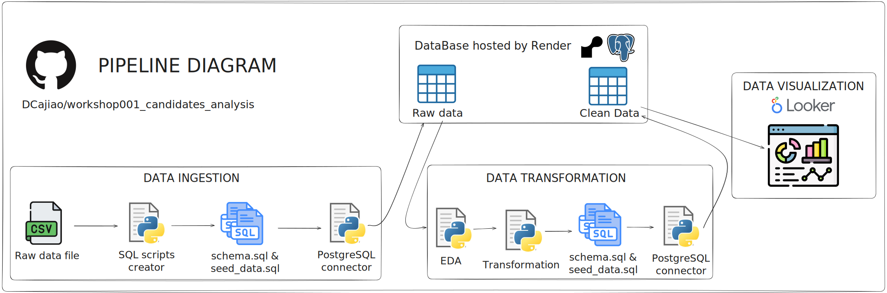

<center>

# 🛠️ ETL Workshop: Candidates Analysis

</center>

## 🤔 What is this?

This project is an **ETL workshop** that I developed to walk participants through building a complete ETL (Extract, Transform, Load) pipeline for analyzing candidate data. The goal of this workshop is to teach best practices in data engineering, from data acquisition to final visualization. The workshop covers everything from raw data ingestion to data cleaning, transformation, and loading into a database, as well as generating insightful visualizations and reports.

### 🔨 Technologies Used

- **Python**: The main programming language used for data extraction, transformation, and loading.
- **Poetry**: A tool for dependency management and packaging in Python projects.
- **Jupyter Notebooks**: Used for data exploration, cleaning, and analysis.
- **SQL**: For database management and querying.
- **Render**: A cloud service used to deploy databases.
- **Pandas, NumPy, Matplotlib**: Libraries for data manipulation and visualization.
- **Looker**: Final dashboard viewer.

## 📦 What’s in this repo?

This repository contains everything needed to replicate and understand the entire ETL process, organized into the following directories:

```plaintext
/workshop001_candidates_analysis/
│
├── /data/                          # Project data (mostly datasets if needed locally)
│   ├── /raw/                       # Raw or unprocessed data
│
├── /notebooks/                     # Jupyter Notebooks used for exploratory analysis and development
│   ├── 00_data_load.ipynb          # Data loading into Postgres
│   ├── 01_data_exploration.ipynb   # Data exploration
│   ├── 02_data_cleaning.ipynb      # Data cleaning
│   └── 03_visualization.ipynb      # Data visualization
│
├── /src/                           # Project source code
│   ├── /connections/               # Database connection scripts
│   │   └── db.py                   # Script for database connection
│   │
│   ├── /utils/                     # Utility functions for the project
│       ├── credentials_management.py # Script for managing credentials
│       └── pysqlschema.py            # Script for managing SQL schemas with Python
│
├── /sql/                           # SQL scripts used in the project
│   ├── schema.sql                  # Database schema definition
│   ├── seed_data.sql               # Script to populate the database with initial data
│   ├── /queries/                   # Frequently used or complex SQL queries
│   │   ├── 001_view_tables.sql     # View tables in the database
│   │   ├── 002_drop_tables.sql     # Drop tables from the database
│   │   ├── 003_view_tables_sizes.sql # View sizes of tables in the database
│   │   ├── 004_get_raw_data.sql    # Query to retrieve raw data
│   │   └── 005_get_clean_data.sql  # Query to retrieve cleaned data
│   └── /migrations/                # Database migrations
│       ├── schema_clean.sql        # Clean schema migration
│       └── seed_data_clean.sql     # Clean seed data migration
│
├── /reports/                       # Reports generated during the project
│   │   /project_results            # Folder with the final pdf report
│   │   └── ETL_Workshop_001_-_Final_Report_Candidates_Analysis  # Final report pdf
│   └── /dashboard/                 # Dashboards and visual reports
│       └── ETL-Workshop01-Candidates.pdf # Final report on candidates analysis
│
├── /docs/                          # Project documentation
│   ├── README.md                   # Summary of the documentation
│   ├── /app/                       # Documentation specific to the app (e.g., PySQLSchema)
│   ├── /data_pipeline/             # Documentation for the data pipeline (e.g., pipeline diagrams)
│   │   └── pipeline.svg            # Data pipeline visualization
│   └── /database/                  # Documentation for the database
│       ├── how_to_deploy_databases_on_render.md # Guide for deploying databases on Render
│       └── /img/                   # Images used in the documentation
│           ├── screenshot1.png     # Screenshot 1
│           ├── screenshot2.png     # Screenshot 2
│           └── screenshot3.png     # Screenshot 3
│
├── .env                            # Environment variables (like database credentials)
├── .gitignore                      # Files and folders to be ignored in version control
├── pyproject.toml                  # Poetry configuration file for managing dependencies and scripts
└── README.md                       # General project overview
```

## ▶️ How do I run this repo?

### Requirements

Before getting started, make sure you have the following installed:

- Python 3.8 or higher
- Poetry 1.1.8 or higher

### Installation

1. **Clone the repository:**

   ```bash
   git clone https://github.com/DCajiao/workshop001_candidates_analysis
   cd workshop001_candidates_analysis
   ```

2. **Install dependencies with Poetry:**

   ```bash
   poetry install
   ```

   This command will install all necessary dependencies as defined in the `pyproject.toml` file.

3. **Activate the Poetry virtual environment:**

   ```bash
   poetry shell
   ```

4. **Configure environment variables:**

   Ensure that the `.env` file is properly configured with your database credentials and any other necessary parameters.

### Running the Pipeline

Once your environment is set up, you can run the ETL scripts by following the steps in the Jupyter Notebooks or by executing the scripts directly from the `src/` directory.

---

## 🛣️ Data Pipeline Diagram



## 📊 Final Dashboard & Report

* Online Version: [Looker dashboard](https://lookerstudio.google.com/reporting/67a21901-1ed4-4228-a0b9-88bc08a653e1)
* Offline Version: [PDF](https://github.com/DCajiao/workshop001_candidates_analysis/blob/develop/reports/dashboard/ETL-Workshop01-Candidates.pdf)
* Report of project: [Documentation](https://github.com/DCajiao/workshop001_candidates_analysis/blob/develop/reports/project_results/ETL_Workshop_001_-_Final_Report_Candidates_Analysis.pdf)

## 🎯 Additional information on this project

* A custom package was built to automate sql script generation. Take a look at the [documentation](https://github.com/DCajiao/workshop001_candidates_analysis/blob/main/docs/app/PySQLSchema.md) and the [script](https://github.com/DCajiao/workshop001_candidates_analysis/blob/main/src/utils/pysqlschema.py).

* Write [documentation](https://github.com/DCajiao/workshop001_candidates_analysis/blob/main/docs/database/how_to_deploy_databases_on_render.md) on how to create and use a free instance on Render

---