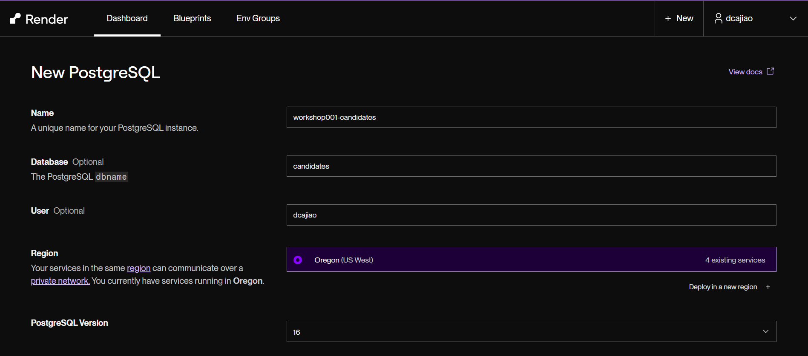
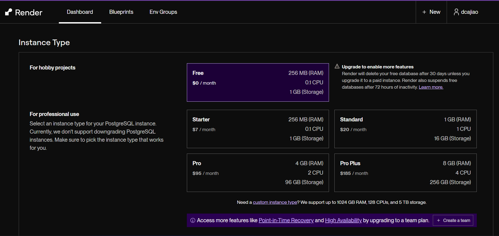
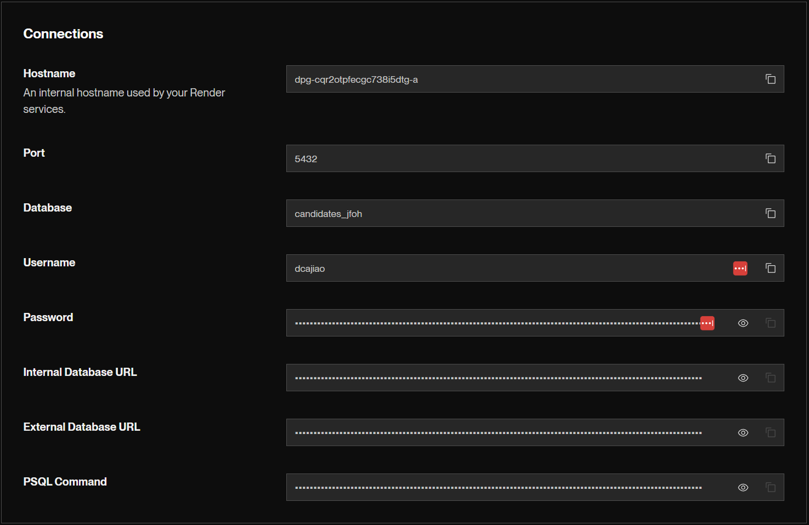

<center>

# 🚀 Deploying a Free PostgreSQL Database on [Render.com](https://render.com)
</center>

*by DCajiao*

This guide walks you through the steps to deploy a **free** PostgreSQL database on Render.com, perfect for small projects or testing environments. Below are the steps with corresponding screenshots to help you through the process.

## 1. Create a New PostgreSQL Instance

First, log in to your [Render.com](https://render.com) account. Click on **+ New** and choose **PostgreSQL**.

### Initial Setup
Fill in the following fields:
- **Name**: A unique name for your PostgreSQL instance (e.g., `workshop001-candidates`).
- **Database**: (Optional) Name of the database.
- **User**: (Optional) Database username.
- **Region**: Select the region where you want to deploy your database.



### Select Instance Type

Render offers various instance types. For this guide, select the **Free** option:
- **RAM**: 256 MB
- **CPU**: 0.1
- **Storage**: 1 GB

⚠️ Note: The free database will be deleted after 30 days unless upgraded, and it will be suspended after 72 hours of inactivity.



### Database Connection Details

Once the instance is created, Render provides you with connection details:
- **Hostname**: Internal hostname for connecting Render services.
- **Port**: Default PostgreSQL port, 5432.
- **Database**: Your database name.
- **Username**: The username you chose.
- **Password**: Auto-generated password.

💾 Be sure to save this information securely!



## 2. Connect to Your Database

You can connect to your database using tools like `psql`, DBeaver, or any PostgreSQL client with the provided connection details.

### Example Connection with `psql`

```bash
psql -h <hostname> -p <port> -U <username> -d <database>
```

When prompted, enter the password generated during the setup.

## 3. Managing and Upgrading

You can manage your database directly from the Render.com dashboard. If you require more resources, consider upgrading to a paid instance.

---